# � Welcome to Kallia


**Kallia** is a semantic document processing library that converts documents into intelligent semantic chunks while preserving context and semantic relationships.


## Overview

Kallia is a powerful semantic document processing library designed to transform documents into meaningful, contextually-aware chunks. Built with modern AI and machine learning techniques, Kallia specializes in extracting and organizing content while maintaining the semantic relationships that make information truly useful.

```mermaid
graph TD
    A[📄 Documents] --> B[🔄 Kallia Processing]
    B --> C[🧠 Intelligent Semantic Chunks]
    C --> D[💭 Conversational Memories]
    C --> E[🎯 Context Preservation]
    C --> F[🔗 Semantic Relationships]

    D --> G[🚀 RESTful API]
    E --> G
    F --> G

    G --> H[🎮 Interactive Playground]
    G --> I[❓ Q&A Systems]

    style A fill:#e1f5fe
    style B fill:#f3e5f5
    style C fill:#e8f5e8
    style G fill:#fff3e0
    style H fill:#fce4ec
    style I fill:#f1f8e9
```

**Kallia converts documents into intelligent semantic chunks that preserve context and meaning, enabling better document understanding and processing for AI applications through our comprehensive API and playground interface.**

## Key Capabilities

- **🔄 Document Processing**: Convert PDFs and other documents to structured markdown
- **🧠 Semantic Chunking**: Intelligent content segmentation that respects document structure
- **💭 Memory Generation**: Create long-term and short-term memories from conversations
- **🚀 RESTful API**: FastAPI-based service with comprehensive endpoints
- **🎮 Interactive Playground**: Chainlit-powered chat interface for document Q&A
- **🐳 Docker Support**: Containerized deployment for easy scaling

## Quick links


[what-we-do.md](overview/what-we-do.md)



[our-features.md](overview/our-features.md)


## Get Started

We've put together some helpful guides for you to get setup with our product quickly and easily.


[getting-set-up](fundamentals/getting-set-up/)


## Use Cases

Explore practical applications of Kallia's document processing capabilities.


[document-chunking.md](use-cases/document-chunking.md)



[memory-generation.md](use-cases/memory-generation.md)

